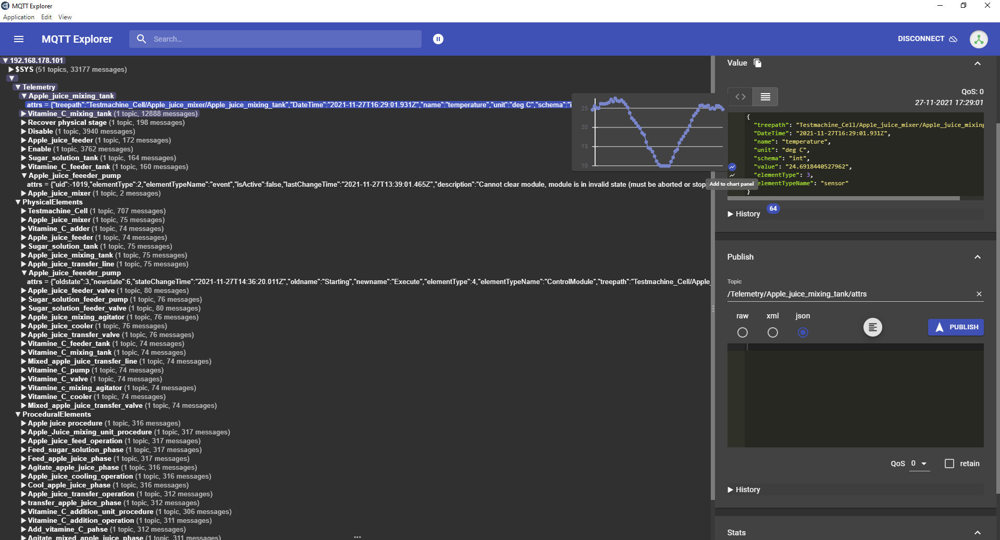

# Protocol

This document describes how the data should be formatted to be sent over MQTT.

## ISA S88

[ISA 88] is a standard for batch controlled production environments. It indicates how a production system is set up in order to create the highest possible equality and copy ability for all parts of the system. The production environment is divided into logical blocks based on modules. The intention of the standard is to realize functionality based on these blocks, which can be reused in other parts of the production environment so that only one part needs to be designed.

### Procedural and Physical model

A number of models are defined within the ISA 88 standard. The 2 most important are the procedural and physical models. These define how the plant is physically arranged, ie where the valves and pumps form a filling system or a cooling system. And a procedural model that says what steps need to be taken to activate the cooling, or the steps to do a fill action. These models start with the smallest level of description and work towards ever-increasing parts in a factory.

### Procedural model

The procedural model works together with the physical model to model the factory. The procedural model defines the steps that the module must go through to get an action done. The details of the steps vary per module. Within the procedural model we have the following modules:

* Procedure – Controlled a Process cell, is usually created in a batch program
* Unit Procedure – Controlled a Unit, is a collection of operations
* Operation – Controls an Equipment module, an action such as filling, emptying, cooling, heating
* Phase – Controls a control module, actions such as open, close, start, stop

### Physical Model

A production environment naturally includes many physical elements, valves, pumps, tanks, coolers and mixers, for example. These elements are brought together in a physical model so that more complex elements can be built up from basic elements (control modules). Bringing together these control modules, for example, creates a tank with a function. This tank can then serve as the basis (template) for the following equal tanks. In this way, only 1 complex element needs to be designed and described. The entire structure of the physical model is as follows:

* Site – A factory site, for example, production location Y.
* Area – Part of a site where a process cell can be located, building X.
* Process Cell – Part of a factory with different Units
* Unit – A part of a factory where a certain product undergoes a change.
* Equipment Module – A collection of control modules that perform a task, fill, cool, and mix.
* Control Module – A valve, pump, motor.


The Physical Model is what we want to show in our online representation in Grafana (Digital Twin) and is made available via MQTT

## S88 Translation to IoT

Besides the PackML states of the physical model and the Elements of the Procedural model, we've chosen to also define telemetry, command and event data of the SMB. How this data is setup is declared as follows

### Providing the PackML states

[PackML schema.json]

[Example configuration shell script](configuration/Juicer_Startup_PackML_configuration.sh)

### Providing the Procedural Elements

[Procedural Elements schema.json]

[Example configuration shell script](configuration/Juicer_Startup_proceduralElements_configuration.sh)

### Providing the telemetry data

[Telemetry schema.json]

[Example configuration shell script](configuration/Juicer_Startup_telemetry_configuration.sh)

### Providing command data

[Commands schema.json]

[Example configuration shell script](configuration/Juicer_Startup_Commands_configuration.sh)

### Providing the event data

[Events schema.json]

[Example configuration shell script](configuration/Juicer_Startup_events_configuration.sh)

[Top](#top)

### MQTT Topics

* PackML
  * attrs
    * oldstate
    * newstate
    * stateChangeTime
    * oldname
    * newname
    * treepath
* ProceduralElements
  * attrs
    * commandSTate
    * stateChangeTime
    * commandKey
    * caller
    * elementType
    * result
    * durantion
    * contextId
    * executer
    * treepath
* telemetry
  * attrs
    * name
    * unit
    * schema
    * value
    * DateTime
    * treepath
* commands
  * attrs
    * commandSTate
    * stateChangeTime
    * commandKey
    * caller
    * elementType
    * result
    * durantion
    * contextId
    * executer
    * treepath
* events
  * attrs
    * uid
    * isActive
    * lastChangeTime
    * description
    * arguments
    * severity
    * treepath

## MQTT Example

In our project, we have the following structure

### PackML

* **Testmachine_cell** (Process Cell)

```json
PackML/Testmachine_Cell/attrs
```

```json
{
  "oldMode": 1,
  "newMode": 1,
  "modeChangeTime": "2021-11-23T19:55:23.257Z",
  "oldname": "Production",
  "newname": "Production",
  "treepath": ""
}
```

* **Apple_juice_mixer** (Unit)

```json
PackML/Apple_juice_mixer/attrs
```

```json
{
  "oldstate": 10,
  "newstate": 11,
  "stateChangeTime": "2021-11-23T19:43:19.176Z",
  "oldname": "Holding",
  "newname": "Held",
  "treepath": "Testmachine_Cell/Apple_juice_mixer"
}
```

* **Apple_juice_mixing_tank** (Equipment Module)

```json
PackML/Apple_juice_mixing_tank/attrs
```

```json
{
  "oldstate": 10,
  "newstate": 11,
  "stateChangeTime": "2021-11-23T19:43:19.175Z",
  "oldname": "Holding",
  "newname": "Held",
  "treepath": "Testmachine_Cell/Apple_juice_mixer/Apple_juice_mixing_tank"
}
```

* **Apple_juice_mixing_agitator** (Control Module)

```json
PackML/Apple_juice_mixing_agitator/attrs
```

```json
{
  "oldstate": 10,
  "newstate": 11,
  "stateChangeTime": "2021-11-23T19:43:19.174Z",
  "oldname": "Holding",
  "newname": "Held",
  "treepath": "Testmachine_Cell/Apple_juice_mixer/Apple_juice_mixing_tank/Apple_juice_mixing_agitator"
}
```

### telemetry

```json
telemetry/Apple_juice_mixing_tank/attrs
```

```json
{
  "treepath": "Testmachine_Cell/Apple_juice_mixer/Apple_juice_mixing_tank",
  "DateTime": "2021-11-23T20:03:01.048Z",
  "name": "temperature",
  "unit": "deg C",
  "schema": "int",
  "value": "36.2869306477454"
}
```

### commands

```json
commands/Enable/attrs
```

```json
{
  "commandState": "Completed",
  "stateChangeTime": "2021-11-23T19:43:14.110Z",
  "commandKey": "Enable",
  "caller": "Mixed_apple_juice_transfer_valve",
  "elementType": "Command",
  "result": 2147483647,
  "duration": 53,
  "contextId": "2021-11-23-19:42:10.032_9",
  "executer": "Testmachine_Cell/Vitamine_C_adder/Mixed_apple_juice_transfer_line/Mixed_apple_juice_transfer_valve",
  "treepath": ""
}
```

### ProceduralElements

```json
ProceduralElements/Cool_apple_juice_phase/attrs
```

```json
{
  "commandState": "Completed",
  "stateChangeTime": "2021-11-23T19:42:37.981Z",
  "commandKey": "Cool_apple_juice_phase",
  "caller": "Apple_juice_mixing_tank",
  "elementType": "Phase",
  "result": 2147483647,
  "duration": 0,
  "contextId": "2021-11-23-19:42:10.032_9",
  "executer": "",
  "treepath": "Brix_Tc3_App_JBFDemonstrator.JBF_Demonstrator.MAIN._controller._phCoolAppleJuice[0]/Cool_apple_juice_phase"
}
```

### events

```json
events/Vitamine_C_feeder_tank/attrs
```

```json

{
  "uid": -12334,
  "isActive": true,
  "lastChangeTime": "2021-11-23T19:42:43.100Z",
  "description": "test event {0} {1} {2} {3}",
  "severity": 1,
  "treePath": "Brix_Tc3_App_JBFDemonstrator.JBF_Demonstrator.MAIN._controller._emVitamineCFeeder/Vitamine_C_feeder_tank"
}
```

In an application as MQTT Explorer it shows as follows:



[ISA 88]: https://iautomation.nl/techniek/automatiseringstechniek/isa-88/?lang=en "ISA S88"
[UltraLight 2.0]: https://fiware-iotagent-ul.readthedocs.io/en/latest/usermanual/index.html#user-programmers-manual "Ultralight 2.0 Protocol"
[MQTT Explorer]: http://mqtt-explorer.com/ "MQTT Explorer"
[PackML schema.json]: configuration/PackML/schema.json "PackML schema.json"
[Procedural Elements schema.json]: configuration/ProceduralElements/schema.json "Procedural Elements schema.json"
[Telemetry schema.json]: configuration/Telemetry/schema.json "Telemetry schema.json"
[Commands schema.json]: configuration/Commands/schema.json "Commands schema.json"
[Events schema.json]: configuration/Events/schema.json "Events schema.json"
