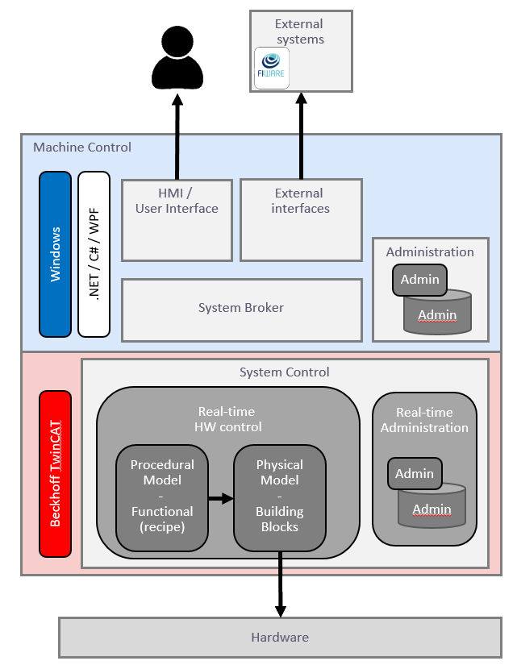

# Architecture

A general schematic of the (software) architecture can be seen below:

    

spacer text

## Hardware

The physical hardware is stuff you can touch in the real world. This can be temperature sensors, actuators but also lights or complete mixing units. The hardware is connected to a PLC, via electrical inputs/outputs or via a communication bus like EtherCAT. The hardware will be managed and controlled by the software. In our case: a Beckhoff TwinCAT environment

## System Control

The controlsoftware is developed by a ISA S88 structure, so it allready is a digital twin of the hardware. This part of the software is 'real time'. The PLC has something you could call a database, but it's not used for historical data. It's used to keep track of it's production and actual receipe values.

## Machine Control

The Machine Control can be devided by a few parts

### System Broker

The name 'System Broker' communicates with the PLC and allows for different sources to retreive or send data to the PLC (Machine). It also places data in a database to allow for historical data and log information.

### HMI / User Interface

The HMI of the machine should get complete control over the machine. It allows to start/stop procedures and change recipes. The HMI is what an machine operator sees when (s)he is operating the machine. It also allows service-engineers to change settings that an 'normal operator' doesnt have the rights (and expertise) to do.

### External Interfaces

Via an External Interface, it's only allowed to 'read' machine properties. So we can only see the current temperatur, place of the actuator if the lights are on or off, and what the machine is mixing. We can't start the mixing procedure, or recipe values via an external interface. This is only allowed via an HMI.

This project focusses completely on the external interface of the SMB. The SMB shares information via MQTT to an IoT Agent and shares the data in it's own MongoDB database. A Grafana dashboard connects to this and can retreive the historical data from the MongoDB Database. 

For more information see the [IoT Agent docs]

[IoT Agent docs]: https://iotagent-node-lib.readthedocs.io/ "IoT Agent docs"