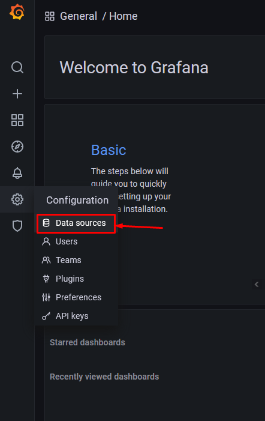
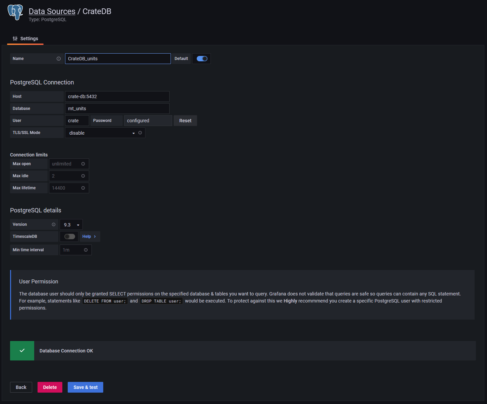
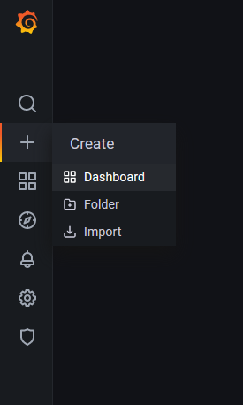
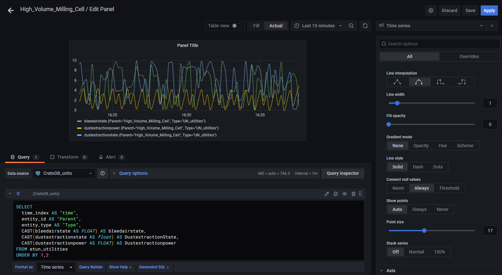
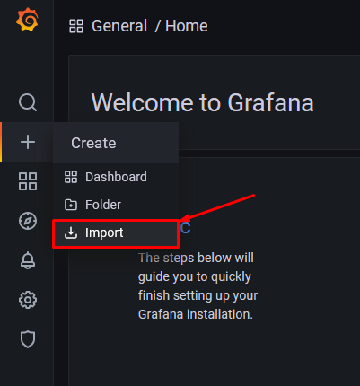
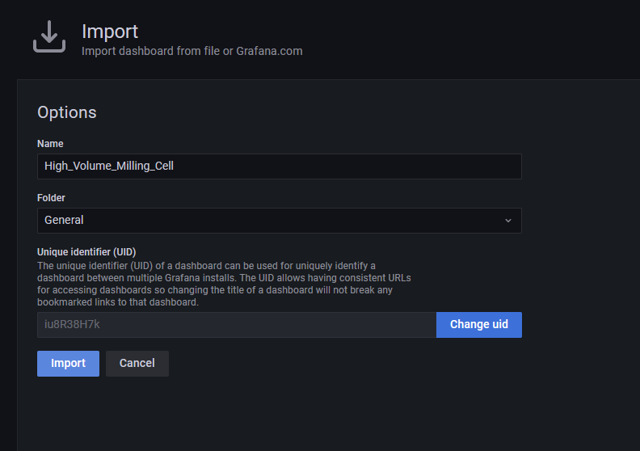

# Installation guide

## Content

- [Docker](#docker)
- [Preparations](#preparations)
- [Configuring fiware IoT Agent](#configuring-fiware-iot-agent)
  - [Creating a new fiware-service](#Creating-a-new-fiware-service)
  - [Configuring the IoT Agent](#configuring-the-iot-agent)
    - [Configuring IoT Agent with multiple variables](#configuring-iot-agent-with-multiple-variables)
- [Configuring the Orion Context Broker](#configuring-the-orion-context-broker)
- [Configuring Grafana](#configuring-grafana)
  - [Add the datasources to Grafana](#add-the-datasources-to-grafana)
  - [Creating a new dashboard](#creating-a-new-dashboard)
  - [Importing a dashboard](#Importing-a-dashboard)

[Top](#top)

## Docker

This manual describes how to configure and start a server via a docker-compose file. Therefore it's required to have docker installed. This manual describes the process on a Windows machine (Windows 10 Professional, version 1909, OS Build 18363.1256), with Docker Engine v20.10.8. However, due to the nature of Docker, this manual should also be sufficient for machines running macOS or Linux.

[Top](#top)

## Preparations

Make sure the docker containers are started and configured correctly. For more information refer to the [Docker README.md](docker/docker-README.md) file.

[Top](#top)

## Configuring fiware IoT Agent

>| :exclamation: Take note of this       |
>|---------------------------------------|
>|From this moment in the readme, there is a lot of manual labour. This labour can, and should be automated. Configuring the server(s) by hand allowes room for error and the risk of typo's is high. We advise to create a program that can|
>
>- Automate the creation of curl command(s) for the IoT Agent
>- Automate the creation of curl command(s) for the Context Broker
>- Generate (the) Grafana dashboard(s)
>
>This readme describes how it's done by hand to explain the works, but don't advise to copy it. The sample project is small, but most machines are complex and have a lot of sensors and variables. If you want implement this for multiple machines, it will quickly pay off to automate this last path of the manual.

When all containers are running, it's time to configure the server to prepare it for your data.

[Top](#top)

### Creating a new fiware-service

If you remember our demo S88 project, we have data in our *Units*, *Equipment Modules* and *Control Modules*. The first thing we're going to configure is the Units.

```curl
curl -iX POST \
  'http://192.168.178.101:4041/iot/services' \
  -H 'Content-Type: application/json' \
  -H 'fiware-service: PhysicialElementService' \
  -H 'fiware-servicepath: /PhysicalElementsStates' \
  -d '{
 "services": [
   {
     "apikey":      "PhysicalElements",
     "cbroker":     "http://orion:1026",
     "entity_type": "ProcessCell",
     "resource":    "PhysicalElements/"
   }
 ]
}'
```

[Top](#top)

### Configuring the IoT Agent

In the following example, we configure the MQTT message ```High_Volume_Milling_Cell\UN_machining``` to the fiware-service ```_units```. We define the variable *"g"* from the message ```High_Volume_Milling_Cell\UN_machining\attrs = g|value``` and give it the name *Count* and say it's an text type variable.

[Top](#top)

#### Configuring IoT Agent with multiple variables

```curl
curl -iX POST \
  'http://192.168.178.101:4041/iot/devices' \
  -H 'Content-Type: application/json' \
  -H 'fiware-service: PhysicialElementService' \
  -H 'fiware-servicepath: /PhysicalElementsStates' \
  -d '{
 "devices": [
   {
     "device_id":   "Testmachine_Cell",
     "entity_name": "PhyscialElements",
     "entity_type": "PhysicalElementsStates",
     "transport":   "MQTT",
     "timezone":    "Europe/Berlin",
     "attributes": [
       { "object_id": "oldstate", "name": "oldstate", "type": "int" },
       { "object_id": "newstate", "name": "newstate", "type": "int" },
       { "object_id": "stateChangeTime", "name": "stateChangeTime", "type": "DateTime" },
       { "object_id": "oldname", "name": "oldname", "type": "Text" },
       { "object_id": "newname", "name": "newname", "type": "Text" },
       { "object_id": "elementType", "name": "elementType", "type": "int" },
       { "object_id": "elementTypeName", "name": "elementTypeName", "type": "Text" },
       { "object_id": "treepath", "name": "treepath", "type": "Text" }
     ]
   }
 ]
}'
```

[Top](#top)

## Configuring the Orion Context Broker

```curl
curl -iX POST \
  'http://192.168.178.101:1026/v2/subscriptions/' \
  -H 'Content-Type: application/json' \
  -H 'fiware-service: PhysicialElementService' \
  -H 'fiware-servicepath: /PhysicalElementsStates' \
  -d '{
  "description": "plc_id",
  "subject": {
    "entities": [
      {
        "idPattern": "PhyscialElements"
      }
    ],
    "condition": {
      "attrs": [
        "oldstate", "newstate", "oldname", "newname", "stateChangeTime", "elementType", "elementTypeName", "treepath"
      ]
    }
  },
  "notification": {
    "http": {
      "url": "http://quantumleap:8668/v2/notify"
    },
    "attrs": [
      "oldstate", "newstate", "oldname", "newname", "stateChangeTime", "elementType", "elementTypeName", "treepath"
    ],
    "onlyChangedAttrs":false,
    "metadata": ["dateCreated", "dateModified"]
  }
}'
```

To see an example of configuring a complete physical ISA S88 model, view the [Example configuration shell script](configuration/Juicer_Startup_PhysicalElements_configuration.sh) of the 'Apple juicer factory'.

[Top](#top)

## Configuring Grafana

When you visit the Grafana webinterface for the first time, you will have to set a password for the default ```admin``` user. When this is done, you can configure the datasources.

See also the [Video of setting up Grafana]

[Top](#top)

### Add the datasources to Grafana

1. Go to the 'Configuration - cogwheel' in the vertical menu on the right, and select ```Data sources```.


2. Press the blue button ```Add data source```.
3. Select PostgreSQL.
4. Change the Name, Host, Database and User. Disable the TLS/SSL Mode
   - Host should correspond with the hostname of the crate-db container that was configured in the docker-compose file.
   - Database should start with ```mt``` followed by the fiware-services that are configured. To see the different databases, visit the Mongo-DB web interface on http://mongo-db:4200
   - User should be crate without an password
   - Disable the TLS/SSL Mode
5. Save & test the connection


[Top](#top)

### Creating a new dashboard

To create a new dashboard, click on the vertical menu.


To show the data, we've made the following SQL-Query:

```SQL
SELECT 
  time_index AS "time",
  entity_id AS "Parent",
  entity_type AS "Type",
  CAST(bleedairstate AS FLOAT) AS bleedairstate,
  CAST(dustextractionstate AS FLOAT) AS DustextractionState,
  CAST(dustextractionpower AS FLOAT) AS Dustextractionpower
FROM etun_utilities
ORDER BY 1
```

We show the time of the values, show the ```entity_id``` as parent so we can rebuild our digital Twin and show the source of the values shown. Because we saved the values as Text in [Configuring IoT Agent with multiple variables](#configuring-iot-agent-with-multiple-variables) We have to cast the values as ```FLOAT``` to make them numeric



[Top](#top)

### Importing a dashboard

The final goal should be to generate the Grafana dashboard by an external program. The generated JSON can be imported by:

1. Click on the ```+``` sign in the vertical menu
2. And select ```Import``` in the submenu

3. Select the json file you've generated and click ```Import```

4. Your dashboard is imported.

[Top](#top)

[Video of setting up Grafana]: https://github.com/demkoen/DIH2-Phase3/blob/feature/step-by-step-tutorial/demos/Creating_Grafana_dashboard.mkv "Video of setting up Grafana"
