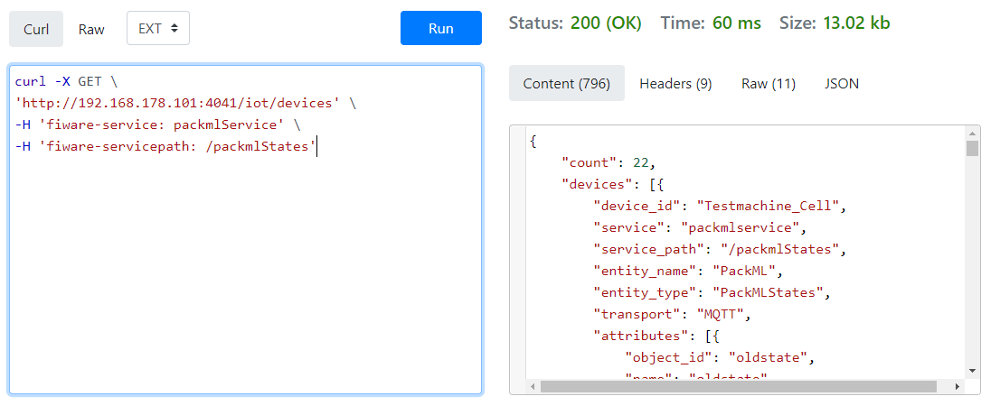

# User manual

## Content

- [Preconditions](#preconditions)
- [MQTT Explorer](#mqtt-explorer)
  - [Creating a new connection](#creating-a-new-connection)
  - [Analyzing the messages](#analyzing-the-messages)
- [IoT Agent](#iot-agent)
  - [Check registered devices](#Check-registered-devices)
- [CrateDB](cratedb)
- [Grafana](#grafana)

[Top](#top)

## Preconditions

This manual expects that the installation and configuration of the server is completed (as is described in the [Installation & Administration Guide](installationguide.md) ) and working as expected.

[Top](#top)

## MQTT Explorer

MQTT Explorer is a comprehensive and easy-to-use MQTT Client.

### Creating a new connection

When the application is started, the following screen appears:


Enter the ```hostname``` or ```Ip address``` of the machine that is running the docker containers. (It can be localhost if you are running this on the machine itself)

### Analyzing the messages

When the connection is made, this application shows and monitors the sent messages from and to the broker, as shown in the following screenshot


[Top](#top)

## IoT Agent

### Check registered devices

| :information_source: Tip                                                               |
|----------------------------------------------------------------------------------------|
|use [reqbin.com/curl](https://reqbin.com/curl) for in browser curl commands and feedback or an application like Postman|

To check the devices that are registerd in the IoT agent you need to know the registered service. In our example project, the fiware-service is ```packmlService``` and the servicepath is ```/packmlStates```.



example code:

```curl
curl -X GET \
'http://192.168.178.101:4041/iot/devices' \
-H 'fiware-service: packmlService' \
-H 'fiware-servicepath: /packmlStates'
```

Please refer to the [Fiware IoT Agent documentation](https://github.com/FIWARE/tutorials.IoT-Agent) for other commands

[Top](#top)

## CrateDB

CrateDB has a webinterface that can be used for debugging and to check if the database(s) and table(s) are made.


Example query

```sql
SELECT *
FROM "mtpackmlservice"."etpackmlstates"
Order by time_index DESC
LIMIT 100;
```

Please refer to the [CrateDB documentation](https://crate.io/docs/) for more advanced documentation

[Top](#top)

## Grafana

Basic setup and configuration of Grafana is done in the [Installation & Administration Guide](installationguide.md).
See also the [Video of setting up Grafana].

Grafana is an enormous and powerfull tool. The implementation is different for every usecase. Please refer to the lates [Grafana documentation](https://grafana.com/docs/grafana/latest/) to use it's full potential

[Top](#top)

[Video of setting up Grafana]: https://github.com/demkoen/DIH2-Phase3/blob/feature/step-by-step-tutorial/demos/Creating_Grafana_dashboard.mkv "Video of setting up Grafana"
